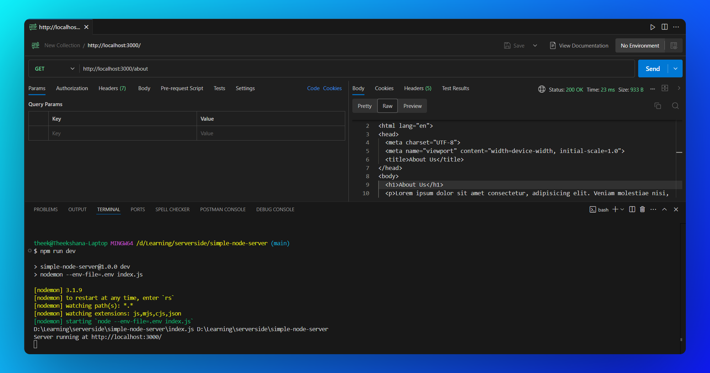

# Simple Node Server with Routing

[](https://nodejs.org/)
[](https://opensource.org/licenses/MIT)

A simple HTTP server built using Node.js's built-in `http` module. This project demonstrates basic routing and serves static HTML files. It is designed as a learning exercise to understand the fundamentals of server-side programming and routing before transitioning to more advanced frameworks like Express.js.



> *This screenshot illustrates the output when making a GET request to the `/about` path of the Node.js HTTP server using the Postman extension within VS Code. The server correctly responds with a basic HTML page, demonstrating the routing functionality for the `/about` endpoint.*

## ✨ Features

- Basic HTTP server implementation.
- Serves static HTML files for different routes (`/` and `/about`).
- Handles errors for unsupported routes and methods.
- Uses Node.js's built-in `http` module and `fs/promises` for file handling.
- Configures the server port using environment variables (`.env` file).
- Lightweight and beginner-friendly.

## 🎯 Purpose

This project was created to:

- Understand how to create a basic server using Node.js's `http` module.
- Learn how to implement basic routing for different URL paths.
- Explore serving static HTML files instead of plain text responses.
- Practice using environment variables for configuration (e.g., port numbers).
- Build a foundation for developing more complex web applications and APIs.

## 🚀 How to Run

1. **Clone this repository:**

   ```bash
   git clone https://github.com/theekshana-nirmal/simple-node-server.git
   ```

   ```bash
   cd simple-node-server
   ```
2. **Install dependencies:**

   ```bash
   npm install
   ```
3. **Create a `.env` file:**
   Create a file named `.env` in the root directory of the project and add the following line:

   ```env
   PORT=3000
   ```

   *(You can change `3000` to any port you prefer)*
4. **Create the `public` directory:**
   Inside the project root, create a folder named `public` and add the following files:

   - `index.html`: The homepage content.
   - `about.html`: The content for the `/about` route.
5. **Start the server:**

   ```bash
   npm run dev
   ```
6. **Access the server:**
   Open your web browser and navigate to:

   - `http://localhost:PORT/` for the homepage.
   - `http://localhost:PORT/about` for the about page.

   *(Replace `PORT` with the value you set in your `.env` file, e.g., `http://localhost:3000/`)*

## 📚 Learning Objectives

- Understand how to create a basic server using Node.js's `http` module.
- Learn how to implement routing to handle different URL paths.
- Explore serving static HTML files using `fs/promises`.
- Grasp the concept of ports and listening for incoming connections.
- Learn how to manage configuration like port numbers using environment variables (`.env` files).
- Build a foundational understanding for developing more complex web applications and APIs.

## 🌱 Future Plans

- Add support for more routes and dynamic content.
- Implement error pages for 404 and 500 errors.
- Handle different HTTP methods (e.g., POST, PUT, DELETE).
- Transition to using the Express.js framework for more robust features and easier development.
- Add middleware for logging and request parsing.
- Explore serving static assets like CSS and JavaScript files.
